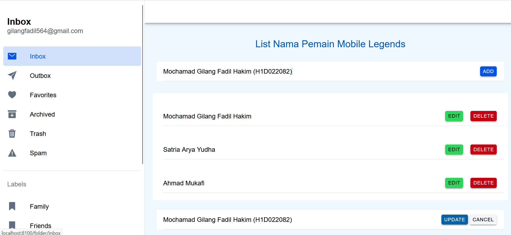
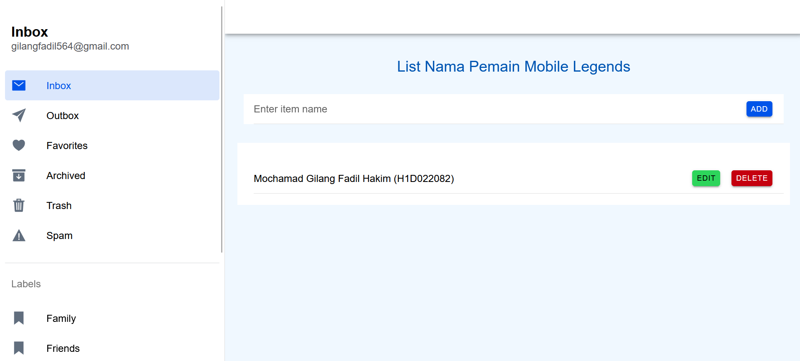

Nama : Mochamad Gilang Fadil Hakim

NIM : H1D022082

Shift Baru: B
## Penjelasan Code 
<ion-header [translucent]="true" style="--background: #007BFF;">
  <ion-toolbar>
    <ion-buttons slot="start">
      <ion-menu-button></ion-menu-button>
    </ion-buttons>
    <ion-title style="color: #FFFFFF;">{{ folder }}</ion-title>
  </ion-toolbar>
</ion-header>

<ion-content [fullscreen]="true" style="--background: #f0f8ff;">
  <ion-header collapse="condense">
    <ion-toolbar style="--background: #007BFF;">
      <ion-title size="large" style="color: #FFFFFF;">{{ folder }}</ion-title>
    </ion-toolbar>
  </ion-header>

  

    <h2 style="color: #0056b3; text-align: center;">List Nama Pemain Mobile Legends</h2>

    <ion-item>
      <ion-input [(ngModel)]="itemName" placeholder="Enter item name"></ion-input>
      <ion-button (click)="addItem()" color="primary">Add</ion-button>
    </ion-item>

    <ion-list>
      <ion-item *ngFor="let item of items; let i = index">
        <ion-label>{{ item }}</ion-label>
        <ion-button slot="end" color="success" (click)="editItem(i)">Edit</ion-button>
        <ion-button slot="end" color="danger" (click)="deleteItem(i)">Delete</ion-button>
      </ion-item>
    </ion-list>
    
    <ion-item *ngIf="isEditing">
      <ion-input [(ngModel)]="itemName" placeholder="Edit item name"></ion-input>
      <ion-button (click)="updateItem()" color="secondary">Update</ion-button>
      <ion-button (click)="cancelEdit()" color="light">Cancel</ion-button>
    </ion-item>
  

</ion-content>

Property:
- folder: Menyimpan judul halaman.
- itemName: Menyimpan nilai input item yang akan ditambahkan atau diubah.
- items: Array yang menyimpan daftar item yang telah dibuat.
- isEditing: Menandai apakah aplikasi sedang dalam mode pengeditan.
- editingIndex: Menyimpan indeks item yang sedang diedit.

Methods:
- addItem(): Menambahkan itemName ke dalam array items jika tidak kosong, kemudian mengosongkan itemName.
- editItem(index: number): Memulai mode edit untuk item di indeks tertentu, menampilkan nama item yang akan diedit.
- updateItem(): Memperbarui item yang sedang diedit dengan itemName baru, kemudian keluar dari mode edit.
- cancelEdit(): Membatalkan mode edit, mengosongkan itemName, dan menghapus status pengeditan.
- deleteItem(index: number): Menghapus item pada indeks tertentu dari array items.

    import { Component } from '@angular/core';

@Component({
  selector: 'app-folder',
  templateUrl: './folder.page.html',
  styleUrls: ['./folder.page.scss'],
})
export class FolderPage {
  folder = "Item Management";
  itemName: string = '';
  items: string[] = [];
  isEditing: boolean = false;
  editingIndex: number | null = null;

  addItem() {
    if (this.itemName.trim()) {
      this.items.push(this.itemName.trim());
      this.itemName = '';
    }
  }

  editItem(index: number) {
    this.isEditing = true;
    this.editingIndex = index;
    this.itemName = this.items[index];
  }

  updateItem() {
    if (this.editingIndex !== null && this.itemName.trim()) {
      this.items[this.editingIndex] = this.itemName.trim();
      this.cancelEdit();
    }
  }

  cancelEdit() {
    this.isEditing = false;
    this.editingIndex = null;
    this.itemName = '';
  }

  deleteItem(index: number) {
    this.items.splice(index, 1);
  }
}

Properties:
- folder: Menyimpan judul halaman ("Item Management").
- itemName: Menyimpan nama item yang akan ditambahkan atau diedit.
- items: Array yang menyimpan daftar semua item.
- isEditing dan editingIndex: Menentukan status mode edit dan indeks item yang sedang diedit.

Methods:
- addItem(): Menambahkan itemName ke items jika tidak kosong, lalu mengosongkan itemName.
- editItem(index): Mengaktifkan mode edit untuk item tertentu.
- updateItem(): Memperbarui item yang sedang diedit dengan nilai itemName baru.
- cancelEdit(): Membatalkan mode edit dan mengosongkan itemName.
- deleteItem(index): Menghapus item pada indeks tertentu dari items.

## Screenshot

