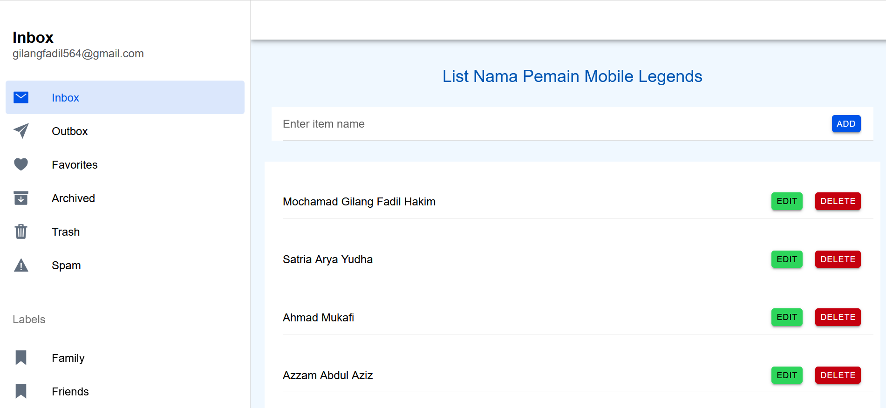

Nama : Mochamad Gilang Fadil Hakim

NIM : H1D022082

Shift Baru: B
## Penjelasan Code 

1. Komponen FolderPage:

Variabel Utama:
- folder digunakan sebagai judul halaman ("Item Management").
- itemName menyimpan nilai input pengguna saat menambah atau mengedit nama item.
- items adalah array yang menyimpan daftar nama pemain yang ditambahkan.
- isEditing dan editingIndex digunakan untuk melacak status dan indeks item yang sedang diedit.

Fungsi CRUD:
- addItem(): Menambahkan nama pemain ke daftar jika tidak kosong.
- editItem(index): Mengaktifkan mode edit untuk item pada indeks yang dipilih.
- updateItem(): Memperbarui item yang sedang diedit dengan nilai baru dan keluar dari mode edit.
- cancelEdit(): Membatalkan proses edit dan menghapus nilai input.
- deleteItem(index): Menghapus item dari daftar berdasarkan indeks.

2. HTML :
- Terdapat header dan konten yang menampilkan judul halaman, input untuk memasukkan nama pemain, dan tombol untuk menambah atau mengedit item.
- ion-item digunakan untuk menampilkan setiap nama pemain dalam daftar, dengan opsi "Edit" dan "Delete" di setiap item.
- Jika mode edit aktif, muncul input tambahan untuk memperbarui nama pemain serta tombol "Update" dan "Cancel."

3. Tata Letak dan Gaya (CSS):
- Warna biru digunakan pada header dan beberapa elemen untuk tampilan menarik dan konsisten.
- #container menambahkan padding di sekitar konten utama.
- ion-item dan ion-list memiliki margin serta padding yang disesuaikan untuk membuat daftar terlihat rapi.
- 
## Screenshot

## Create

## Update

## Delete

